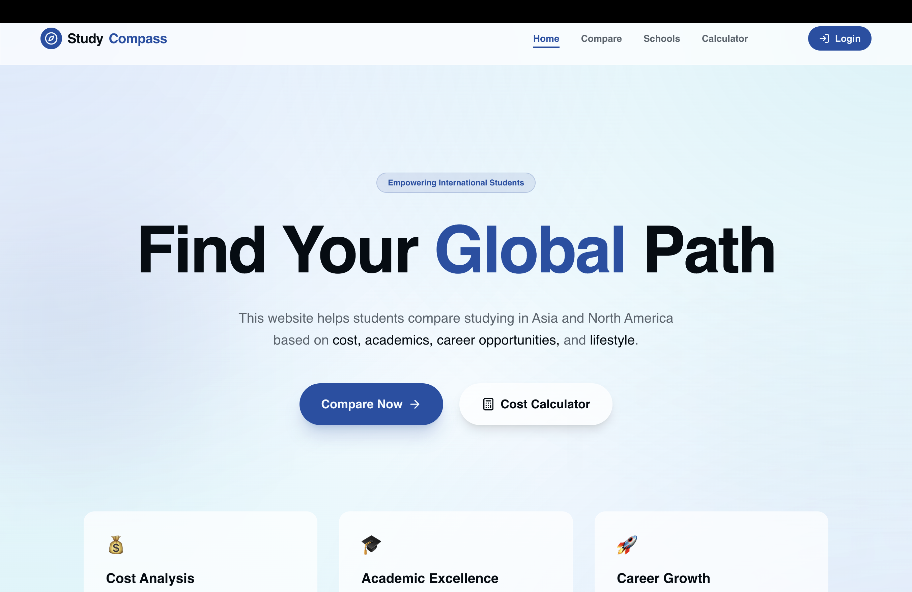
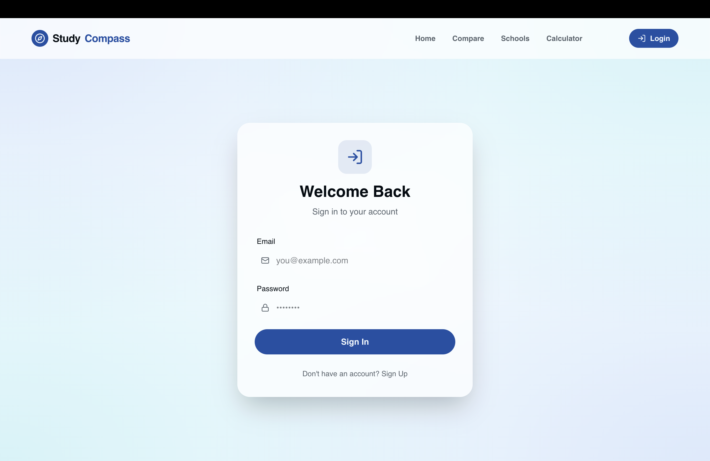

# Study Compass

Study Compass is a student web project for comparing universities in Asia and North America.  
The app helps users view basic information such as tuition, region, academic focus, and application-related details.

I built this project to practice React, TypeScript, Supabase, and responsive frontend development.

## Features

- Compare universities by tuition, region, ranking, and academic information
- Sign up and log in with Supabase Auth
- Store university and application-related data using Supabase
- Display comparison information in a responsive UI
- Basic routing between pages such as Home, Compare, and Login

## Tech Stack

- React
- TypeScript
- Tailwind CSS
- Supabase
- PostgreSQL
- Vite
- Git

## Screenshots

### Home Page



### University Comparison


### Login Page



## Getting Started

### 1. Clone the repository

```bash
git clone https://github.com/Abigail1962/study-compass.git
cd study-compass
